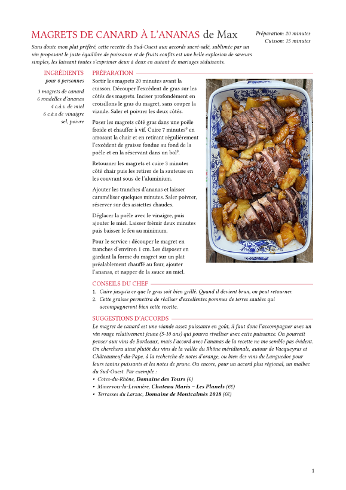
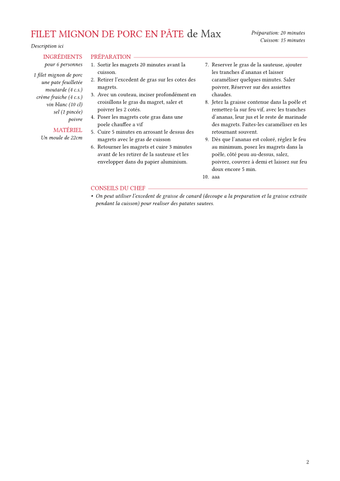

# `typst-recipe`

A template for cooking recipes.

## Example





## How to compile the example

### PDF

```shell
typst compile example.typ
```

### Images

```shell
typst compile example.typ --format png result{0p}.png --ppi 70
```
